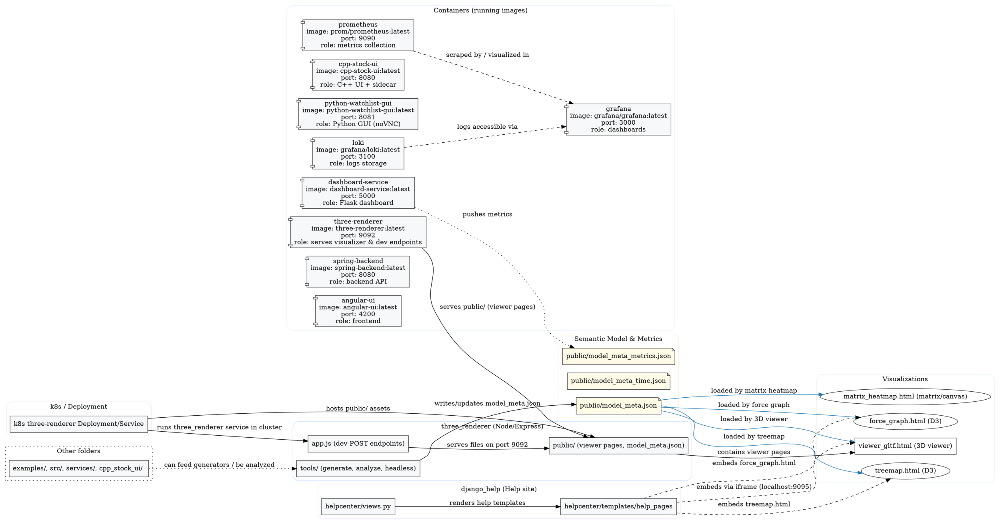

Repository overview (Graphviz DOT)

This file describes the top-level structure and relationships of the repository using Graphviz DOT notation. Save this file as-is and render with `dot -Tpng repo.dot -o repo.png` after extracting the DOT block.

Notes:
- The DOT block above focuses on the runtime relationships: tooling → generated model → visualizations → embedded docs.
- To render, copy the DOT block into a `.dot` file and run Graphviz (e.g., `dot -Tpng repo.dot -o repo.png`).

File created: README_GRAPHVIZ.md
