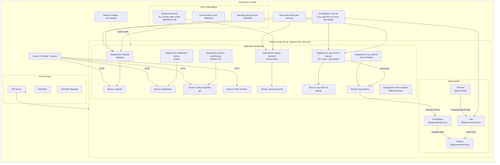

```mermaid
flowchart TD
  subgraph Cluster["Kubernetes Cluster"]
    direction TB

    subgraph CP["Control Plane"]
      APIServer[API Server]
      Scheduler[Scheduler]
      ControllerMgr[Controller Manager]
    end

    subgraph Nodes["Worker Nodes (Pods, Deployments, Services)"]
      direction LR

      subgraph Apps["Application Workloads"]
        direction TB
        HelpsiteDep["Deployment: helpsite\n(Django)"]
        HelpsiteSvc["Service: helpsite"]
        SpringDep["Deployment: spring-backend\n(Spring Boot)"]
        SpringSvc["Service: spring-backend"]
        CPPDep["Deployment: cpp-stock-ui-sidecar\n(C++ app + log-sidecar)"]
        CPPSvc["Service: cpp-stock-ui-sidecar"]
        PythonGUIDep["Deployment: python-watchlist-gui\n(Python GUI)"]
        PythonGUISvc["Service: python-watchlist-gui"]
        DashboardDep["Deployment: dashboard-service\n(Flask)"]
        DashboardSvc["Service: dashboard"]
        LogCollectorDep["Deployment: log-collector\n(Python/Flask)"]
        LogCollectorSvc["Service: log-collector"]
        ThreeRendererDep["Deployment: three-renderer\n(Node/Express)"]
        ThreeRendererSvc["Service: three-renderer"]
      end

      subgraph Observability["Observability"]
        PrometheusDep["Prometheus\n(Deployment/Service)"]
        GrafanaDep["Grafana\n(Deployment/Service)"]
        LokiDep["Loki\n(Deployment/Service)"]
        PromtailDS["Promtail\n(DaemonSet)"]
      end
    end

    ConfigMaps["ConfigMaps / Secrets\n(e.g. cpp-stock-ui-secret, loki-config)"]
    IngressCtrl["Ingress Controller / Ingress"]
    NetPolicies["Network Policies (conceptual)"]
    SvcAccounts["ServiceAccounts (per-service)"]

    subgraph Storage["Data & Messaging"]
      SQLite["SQLite (local files)\n(e.g. spring_hello_world data/stocks.db)"]
      OtherDBs["External DBs (none detected)"]
      MQ["Message Queue (none detected)"]
    end
  end

  IngressCtrl -->|HTTP| HelpsiteSvc
  IngressCtrl -->|HTTP| DashboardSvc
  IngressCtrl -->|HTTP| PythonGUISvc
  IngressCtrl -->|HTTP| ThreeRendererSvc

  HelpsiteDep --> HelpsiteSvc
  SpringDep --> SpringSvc
  CPPDep --> CPPSvc
  PythonGUIDep --> PythonGUISvc
  DashboardDep --> DashboardSvc
  LogCollectorDep --> LogCollectorSvc

  CPPDep -->|writes logs| LogCollectorSvc
  PromtailDS -->|scrapes/forwards logs| LokiDep
  LogCollectorSvc -->|exposes metrics| PrometheusDep
  PrometheusDep -->|visualize data| GrafanaDep
  LokiDep -->|stores logs| GrafanaDep

  ConfigMaps --> HelpsiteDep
  ConfigMaps --> CPPDep
  ConfigMaps --> LokiDep
  SvcAccounts --> HelpsiteDep
  SvcAccounts --> SpringDep
  SvcAccounts --> CPPDep
  NetPolicies -.->|restrict traffic| Apps

  SQLite --> SpringDep
  SQLite --> HelpsiteDep

  CP --> APIServer
  APIServer --> Nodes
```
